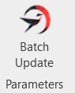
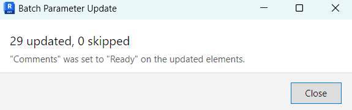
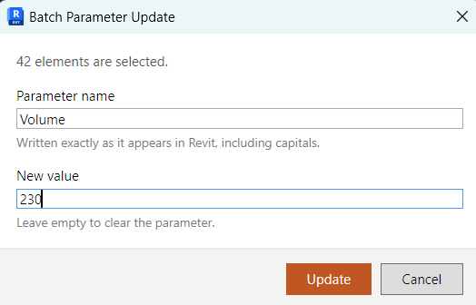
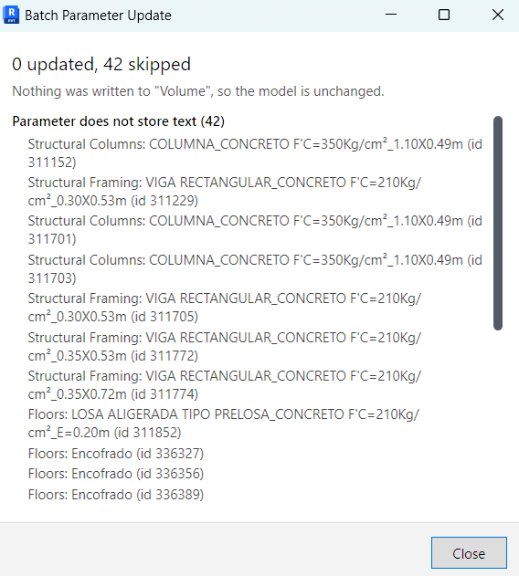

# Batch Parameter Update

A Revit add-in that writes one text value into one instance parameter across every element the
user has selected, in a single transaction.

Select the elements, run the command, type the parameter name and the new value. Every element
that exposes a writable text instance parameter under that name is updated. The rest are
skipped, and the summary says how many were updated, how many were skipped, and why each one
was skipped.

## Supported Revit versions

| Revit | Runtime | Build configuration |
|---|---|---|
| 2023 | .NET Framework 4.8 | `Release.R23` |
| 2024 | .NET Framework 4.8 | `Release.R24` |
| 2025 | .NET 8 | `Release.R25` |
| 2026 | .NET 8 | `Release.R26` |

Each version gets its own assembly, compiled against that version's Revit API, and the
installer deploys the matching one.

Nothing older than 2023 is claimed. Revit 2022 and earlier were never built or opened during
this work, so there is no basis to say they are supported.

## Installation

1. Download `BatchParameterUpdate-Setup-<version>.exe` from the
   [latest release](https://github.com/Matbimdev/revit-batch-parameter-update/releases/latest).
2. Run it. It asks for administrator rights, because it installs for every user of the machine.
3. On the components page, tick the Revit versions you want. The installer preselects the ones
   it finds installed.
4. Start Revit. The button appears on the **BIM Tools** tab, in the **Parameters** panel.

Files are installed to `C:\ProgramData\Autodesk\Revit\Addins\<year>\`, and removed by the
uninstaller in Programs and Features.

If Revit is open while installing, the wizard offers to close it. Revit keeps the assembly
locked while it runs, so the files cannot be replaced until it does.

## Usage

The command sits on the **BIM Tools** tab, in the **Parameters** panel.



1. Select one or more elements in the model.
2. Click **Batch Update**. The button is greyed out while nothing is selected.
3. Type the parameter name exactly as Revit shows it, capitals included, and the value to write.
   Leave the value empty to clear the parameter. The dialog states how many elements are in
   scope, so the selection can be confirmed before anything is written.

   

4. Confirm. The summary reports the result.

   

The whole batch is one transaction, so a single undo takes the model back to where it was.

### What gets skipped, and why

| Reported cause | What it means |
|---|---|
| Parameter not found on the element | No instance parameter carries that name on this element |
| Parameter does not store text | The parameter exists but holds a number, an id or a yes/no value |
| Parameter is read only | The parameter holds text, but Revit does not allow writing to it |
| Element is owned by another user | A workshared model where somebody else holds the element |
| Element no longer exists in the document | The selection carried an id the document no longer resolves |
| Revit did not apply the value | Revit accepted the call but reported that nothing was written |
| Revit refused the change | Revit rejected the write and explained why, its message is shown |

Skipped elements are grouped under the cause that produced them, largest group first, and each
one is named by category, type and id so it can be found in the model.

Below, `Volume` is used as the parameter name over a structural selection. Every element does
carry it, but it stores a number, so nothing is written and the model is left as it was.





## Building from source

### Prerequisites

* Windows
* .NET SDK 8.0 or later, or Visual Studio 2022 17.8 and later. Developed on Visual Studio 2026
  Community with the .NET SDK 10.
* [Inno Setup 6](https://jrsoftware.org/isinfo.php), only to build the installer

**Revit does not need to be installed to build.** The Revit API assemblies come from NuGet, so
the repository compiles on a clean machine. Revit is only needed to run the add-in.

### Build

```
git clone https://github.com/Matbimdev/revit-batch-parameter-update.git
cd revit-batch-parameter-update
dotnet build BatchParameterUpdate.sln -c Release.R26
```

Swap `Release.R26` for `R25`, `R24` or `R23` to target another version. The build produces a
single assembly in `src/BatchParameterUpdate/bin/<configuration>/`, with no third party files
alongside it.

### Debugging

Debug configurations copy themselves into the per user add-ins folder of the matching Revit
version, and the project ships a launch profile per version. Pick `Debug.R26` with the
**Revit 2026** profile and press F5: Visual Studio starts that Revit with the debugger
attached.

A Revit add-in is a class library, so F5 without a launch profile has nothing to start.

Debug builds land in `%AppData%\Autodesk\Revit\Addins\<year>\` while the installer writes to
`C:\ProgramData\...`. Revit loads both, and the button then appears twice. Remove the
`%AppData%` copy before testing an installed build.

### Build the installer

```
cd installer
.\build-installer.ps1 -Version 1.0.0
```

This compiles the four Release configurations and runs the Inno Setup compiler, leaving the
setup executable in `installer/Output/`. Pass `-SkipBuild` to repackage without recompiling.

## How it works

```
src/BatchParameterUpdate/
├─ Application.cs                        IExternalApplication, publishes the ribbon button
├─ Commands/
│  ├─ BatchParameterUpdateCommand.cs     reads the selection, drives the dialogs and the service
│  └─ SelectionAvailability.cs           greys the button out while nothing is selected
├─ Services/
│  ├─ TextParameterResolver.cs           picks the parameter to write, or explains why there is none
│  └─ ParameterUpdateService.cs          the transaction and the loop over the selection
├─ Models/                               skip reasons and the shape of a run's result
└─ Views/                                the input dialog and the summary
```

The command owns the interaction, the service owns every change made to the model, and the
resolver owns every rule about what counts as a valid target. Nothing outside
`ParameterUpdateService` opens a transaction.

## Design decisions

**The Revit API is used directly.** The project uses the Nice3point SDK for the multi version
build and its Revit API reference packages, but not its toolkit or extension libraries. Those
reference packages are reference only, so the output is a single assembly with no third party
files to deploy, and the code shows plain `IExternalCommand`, `PushButtonData` and
`Transaction` usage rather than wrappers around them.

**One transaction covers the whole batch.** A single undo takes the model back to where it
started, which is what a user expects after one command. It also means a run cannot leave the
model half updated.

**Nothing was written means nothing is committed.** When no element could be updated the
transaction is rolled back rather than committed, so the undo stack gains no empty step and the
summary does not claim a change that did not happen.

**A refused element does not stop the run.** The command exists to get through a selection.
Only `Autodesk.Revit.Exceptions.ApplicationException`, the base type of the Revit API
exceptions, is caught around the write, so a genuine defect in this add-in still surfaces
instead of being buried in the summary as a skipped element.

**Skip reasons are decided before the write.** The resolver inspects the candidates and names
the real cause, rather than reporting whatever error the failed write happened to produce.

**Storage type is checked before write access.** The two only overlap on a parameter that is
both numeric and locked, such as Volume, and there the storage type is the more useful answer:
calling it read only suggests that unlocking it would help, when this command could never write
text into it.

**Parameter names match exactly, including capitals.** Accepting a different casing would hide
a typo by writing to a parameter the user did not name.

**Ownership is checked before writing.** In a workshared model, asking Revit who owns an
element turns what would otherwise be one exception per element into a single clear line in the
summary naming the real problem.

**The dialogs use code behind, not MVVM.** Two modal windows holding two strings, living for
the length of one call and sharing state with nothing, do not earn a binding layer.

**Implicit usings are turned off.** Every file declares where its types come from, so a reader
never has to guess.

## Assumptions and limitations

* **Instance parameters only.** `Element.GetParameters` reads the parameters held by the element
  itself, so type parameters are never reached. Changing a type parameter affects every instance
  of that type, which is a different operation from the one this command performs.
* **Text parameters only.** Parameters with `String` storage. Numbers, ids, yes/no values and
  anything else are reported as out of scope rather than converted.
* **The parameter name is matched exactly**, including capitalisation.
* **Elements owned by another user are skipped, not requested.** The command does not try to
  take ownership or place a request.
* **The batch is one undo step.** There is no way to undo part of a run.
* **The summary lists at most 25 elements per cause**, then reports how many more there are. A
  batch over a whole floor can skip thousands of elements, and a list that long says nothing the
  count does not already say.
* **There is no preview.** The command writes when confirmed. The single undo step is the way
  back.
* **The selection is read once, when the command starts.** Anything selected or deselected
  afterwards has no effect on the run.

## License

Proprietary. Provided for evaluation only, all rights reserved. See [LICENSE](LICENSE).
